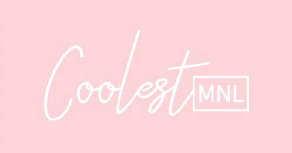

```{r setup, include=FALSE}
knitr::opts_chunk$set(echo = TRUE)
```


<link href="css/modern-business.css" rel="stylesheet">

<style>
.center{
  display: block;
  margin-left: auto;
  margin-right: auto;
  width: 50%;
}

.paddingpic4{
  margin:3px;
}

h4, h5, p{
  font-family:Trebuchet MS;
  color: rgb(81, 90, 90);
}
.withPadding{
  padding:4%;
}

.centerdiv{
  display: inline;
  float: none;
}

</style>

<br>

<br>
<br>

<h2 class="my-4" style="text-align:center">FAQs</h2>

<div class="withPadding">

  <h4>SHOPPING</h4>
  <br>
  <h5>Can I edit my order?</h5>
  
  <p>
  <b>For on-hand/available items:</b> 
  </p>
  <p>
  We can't edit in-stock orders. Sorry! We receive a lot of orders and we are unable to go though them individually as this will cause delays to all other orders. Please review your items before checking out.
  </p>
  
  <p>
  <b>For pre-order items:  </b>
  </p>
  
  <p>
  Shoot us a message on IG or email us if you wish to edit your order!
  </p>
  
  <br>
  <br>
  
  <h5>Can I cancel my order?</h5>
  
  <p>
  <b>For pre-order items:  </b>
  </p>
  
  <p>
  You can’t cancel your order once the cut-off date has passed because that means we already bought the items you ordered.
  </p>
  
  <p>
  <b>For on-hand/available items: </b>
  </p>
  <p>
  You can cancel your order, just shoot us a message and we’ll cancel it for you! Our on-hand items are limited and everyone wants to have one! So if you want to cancel your order, let us know ASAP! Please don’t ghost us! :)
  </p>

</div>