```{r setup, include=FALSE}
knitr::opts_chunk$set(echo = TRUE)
```


<link href="css/modern-business.css" rel="stylesheet">

<style>
.center{
  display: block;
  margin-left: auto;
  margin-right: auto;
  width: 50%;
}

.paddingpic4{
  margin:3px;
}

h4, h5, p{
  font-family:Trebuchet MS;
}
.withPadding{
  padding:4%;
}

.centerdiv{
  display: inline;
  float: none;
}

</style>

<br>

<br>
<br>

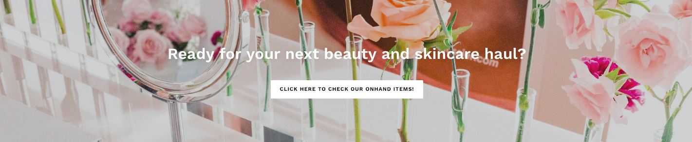


<br>
<br>
<br>
<br>
<h4 style="text-align:center">BRANDS </h4>
<br>
<br>

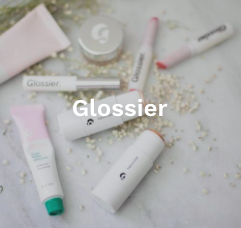
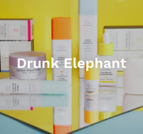
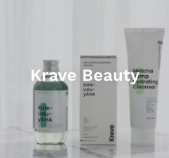
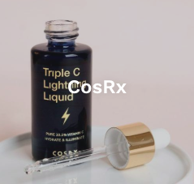

<br>
<br>

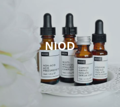
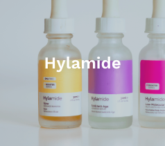

<br>
<br>

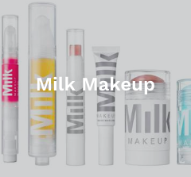
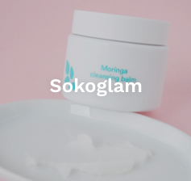

<br>
<br>
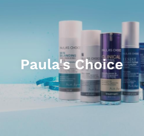
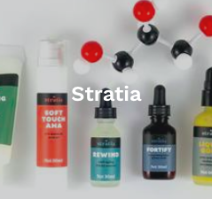
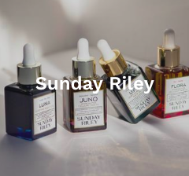
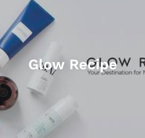

<br>
<br>
<br>
<br>
<h4 style="text-align:center">FEATURED ITEMS </h4>
<br>
<br>
<div class="row">
<div class="col-lg-4 mb-4">
<div class="card h-100">
  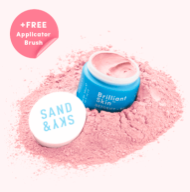
  <br>
  <div class="withPadding">
  <h4>Brillant Skin Purifying Pink Clay Mask</h4>
  <div>
  <p class="card-text">SAN & SKY</p>
  <p><b>P2,600.00</b></p>
  </div>
  </div>
</div>
</div>

<div class="col-lg-4 mb-4">
<div class="card h-100">
  
  <br>
  <div class="withPadding">
  <h4>Brillant Skin Purifying Pink Clay Mask</h4>
  <div>
  <p class="card-text">SAN & SKY</p>
  <p><b>P2,600.00</b></p>
  </div>
  </div>
</div>
</div>

<div class="col-lg-4 mb-4">
<div class="card h-100">
  
  <br>
  <div class="withPadding">
  <h4>Brillant Skin Purifying Pink Clay Mask</h4>
  <div>
  <p class="card-text">SAN & SKY</p>
  <p><b>P2,600.00</b></p>
  </div>
  </div>
</div>
</div>

</div>

<br>
<br>
<div class="row">
<div class="col-lg-4 mb-4">
<div class="card h-100">
  
  <br>
  <div class="withPadding">
  <h4>Brillant Skin Purifying Pink Clay Mask</h4>
  <div>
  <p class="card-text">SAN & SKY</p>
  <p><b>P2,600.00</b></p>
  </div>
  </div>
</div>
</div>

<div class="col-lg-4 mb-4">
<div class="card h-100">
  
  <br>
  <div class="withPadding">
  <h4>Brillant Skin Purifying Pink Clay Mask</h4>
  <div>
  <p class="card-text">SAN & SKY</p>
  <p><b>P2,600.00</b></p>
  </div>
  </div>
</div>
</div>

<div class="col-lg-4 mb-4">
<div class="card h-100">
  
  <br>
  <div class="withPadding">
  <h4>Brillant Skin Purifying Pink Clay Mask</h4>
  <div>
  <p class="card-text">SAN & SKY</p>
  <p><b>P2,600.00</b></p>
  </div>
  </div>
</div>
</div>

</div>

<br>
<br>
<br>
<br>

<br>
<br>
<br>
<br>

<div class="row">

<div class="col-lg-4 mb-4">
<div class="card h-100">
<h4 class="withPadding">Ulta.com 20% off sale until April 20 only!</h4>
<div class="withPadding">
<p class="card-text">Get 20% off at Ulta.com sitewide! HOW TO ORDER: Go to www.ulta.com. To inquire: A. Copy the URL B. Take a screenshot C. Take note of the name of t...</p>
</div>
<div class="withPadding">
<a href="#" class="btn btn-default">Read More</a>
</div>
</div>
</div>

<div class="col-lg-4 mb-4">
<div class="card h-100">
<h4 class="withPadding">Sephora US 15% off sale until April 23 only!</h4>
<div class="withPadding">
<p class="card-text">15% OFF AT WWW.SEPHORA.COM (US website) It's that time of the year again! This sale happens only twice a year and applies to all items at Sephora!...</p>
</div>
<div class="withPadding">
<a href="#" class="btn btn-default">Read More</a>
</div>
</div>
</div>

</div>
